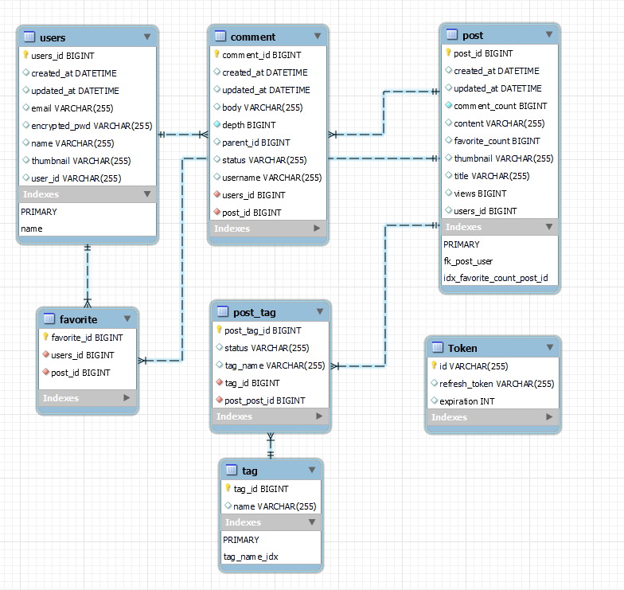

# bloggy
 

## 🗺️ 개요
- 벨로그를 참조하여 블로그를 설계하고 구축
- 이 프로젝트는 다음의 **목표**를 갖는다.
	- 대규모 트래픽과 대용량 데이터 처리
	- 유지보수성을 고려하여 객체지향설계에 따라 개발하고, 테스트코드를 작성
	- CI/CD 를 구성하여 빌드/테스트/배포를 자동화
### 🗺️ 기술 스택
- Java
- SpringBoot
- JPA
- QueryDSL
- MySQL 8.0
- Redis
- Git Action
- AWS

## 🗺️ bloggy 서버 아키텍쳐

## 🗺️ DB ERD

## 🗺️ Technical Issue
- <a href="https://velog.io/@gon109/Tag%EA%B8%B0%EB%8A%A5-%EA%B5%AC%ED%98%84%ED%95%98%EA%B8%B0-1-%EA%B8%B0%EC%A1%B4%EC%9D%98-%ED%83%9C%EA%B7%B8-%EA%B8%B0%EB%8A%A5-%EA%B5%AC%ED%98%84">[#1-1] Post의 Tag기능 구현하기, iterator 사용 방식</a>  
- <a href="https://velog.io/@gon109/Tag%EA%B8%B0%EB%8A%A5-%EA%B5%AC%ED%98%84%ED%95%98%EA%B8%B0-2-iterator-%EC%82%AC%EC%9A%A9-%EC%A0%9C%EA%B1%B0-%EB%B0%8F-%EB%B9%88%EB%B2%88%ED%95%9C-%EC%82%AD%EC%A0%9C%EB%A5%BC-status%EB%A1%9C-%EA%B4%80%EB%A6%AC%ED%95%98%EA%B8%B0">[#1-2] Post의 Tag기능 구현하기, iterator 사용하지 않고, status로 빈번한 삭제 개선</a>   
- <a href="https://velog.io/@gon109/Refresh-Token-%EC%A0%81%EC%9A%A9%EA%B3%BC%EC%A0%95-%EC%9E%91%EC%84%B1%EC%A4%91">[#2-1] Redis를 이용한 Token 적용, Interceptor</a>  
- <a href="https://velog.io/@gon109/AccessToken-%EA%B2%80%EC%A6%9D-%EB%B0%A9%EC%8B%9D-Interceptor%EC%97%90%EC%84%9C-AOP%EB%B0%A9%EC%8B%9D%EC%9C%BC%EB%A1%9C-%EB%B3%80%EA%B2%BD">[#2-2] Redis를 이용한 Token 적용, AOP방식으로 변경</a>   
- <a href="https://velog.io/@gon109/Redis%EB%A5%BC-%EC%82%AC%EC%9A%A9%ED%95%B4%EC%84%9C-%EA%B2%8C%EC%8B%9C%EB%AC%BC-%EC%BA%90%EC%8B%B1%EC%B2%98%EB%A6%AC%ED%95%98%EA%B8%B0-1-%EC%A1%B0%ED%9A%8C-%EC%8B%9C-LookAside%ED%8C%A8%ED%84%B4-%EC%A0%81%EC%9A%A9">[#3-1] Redis를 사용해서 게시물 캐싱 처리하기 (1) 조회 LookAside 패턴</a>  
- <a href="https://velog.io/@gon109/Redis%EB%A5%BC-%EC%82%AC%EC%9A%A9%ED%95%B4%EC%84%9C-%EA%B2%8C%EC%8B%9C%EB%AC%BC-%EC%BA%90%EC%8B%B1%EC%B2%98%EB%A6%AC%ED%95%98%EA%B8%B0-2-Write-back-through-%ED%8C%A8%ED%84%B4-%EC%A0%81%EC%9A%A9">[#3-2] Redis를 사용해서 게시물 캐싱 처리하기 (2) 수정 Write back 패턴 적용 및 keys 대신 scan 사용</a>   
- <a href="https://velog.io/@gon109/%ED%94%84%EB%A1%9C%EC%A0%9D%ED%8A%B8-EC2-%EC%84%9C%EB%B2%84-%EB%B0%B0%ED%8F%AC-DockerGit-Action%EC%9D%84-%ED%99%9C%EC%9A%A9%ED%95%9C-CD-%EC%A0%81%EC%9A%A9-%EA%B3%BC%EC%A0%95-Spring-boot-MySQL-Redis">[#4] Git Action를 이용하여 CD 환경 구축</a>   
- <a href="https://velog.io/@gon109/%EC%8B%A4%EB%AC%B4%EB%A5%BC-%EC%9C%84%ED%95%9C-%EC%99%B8%EB%9E%98%ED%82%A4%EC%9D%98-%EB%AC%BC%EB%A6%AC%EC%A0%81%EC%9D%B8-%EC%A0%9C%EA%B1%B0">[#5] 성능을 위한 외래키의 물리적인 제거</a>   
- <a href="https://velog.io/@gon109/%EC%8A%A4%ED%86%A0%EB%A6%AC%EC%A7%80-%EC%97%94%EC%A7%84-%EB%B6%88%EC%9D%BC%EC%B9%98%EB%A1%9C-%EC%9D%B8%ED%95%9C-Transactional-%ED%85%8C%EC%8A%A4%ED%8A%B8-%EB%8D%B0%EC%9D%B4%ED%84%B0-%EB%A1%A4%EB%B0%B1-%EC%A0%81%EC%9A%A9-%EB%AC%B8%EC%A0%9C-%ED%95%B4%EA%B2%B0">[#6] MyISAM 스토리지 엔진 사용으로 인해 생긴 문제점</a>   
- <a href="https://velog.io/@gon109/QueryDsl-%EC%9D%B8%EB%8D%B1%EC%8A%A4%EB%A5%BC-%EC%82%AC%EC%9A%A9%ED%95%98%EC%97%AC-%EC%BF%BC%EB%A6%AC-%EC%B5%9C%EC%A0%81%ED%99%94%ED%95%98%EA%B8%B0">[#7] 인덱스 및 비정규화를 통한 QueryDSL 페이징 쿼리 최적화 및 테스트 (1)~(7)</a>  
- <a href="https://velog.io/@gon109/CORS%EC%99%80-Preflight-Cross-Site-%ED%99%98%EA%B2%BD-%EC%BF%A0%ED%82%A4-%EB%B8%8C%EB%9D%BC%EC%9A%B0%EC%A0%80-%EA%B1%B0%EB%B6%80-%EB%AC%B8%EC%A0%9C">[#8] CORS와 Preflight, Cross-Site 환경 쿠키 브라우저 거부 문제</a>
- <a href="https://velog.io/@gon109/Ec2-Ubuntu%EC%84%9C%EB%B2%84%EC%97%90-Nginx-%EC%A0%81%EC%9A%A9">[#9] Ec2 Ubuntu서버에 Nginx 적용</a>

## 🗺️ 프로젝트 개선 시나리오

- <a href="https://velog.io/@gon109/%EB%B6%84%EC%82%B0-%ED%99%98%EA%B2%BD%EC%97%90%EC%84%9C-%EC%82%AC%EC%9A%A9%ED%95%A0-%EC%88%98-%EC%97%86%EB%8A%94-Autoincrement-%EC%86%8D%EC%84%B1%EC%9D%84-%ED%95%B4%EA%B2%B0%ED%95%98%EA%B8%B0-%EC%9C%84%ED%95%9C-tuid">[#1-1] 분산 환경에서 사용할 수 없는 Auto_increment 속성을 해결하기 위한 PK 생성전략</a>  
